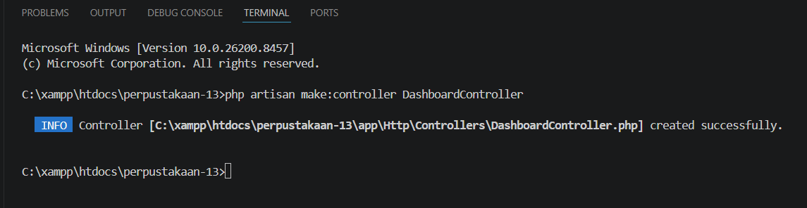
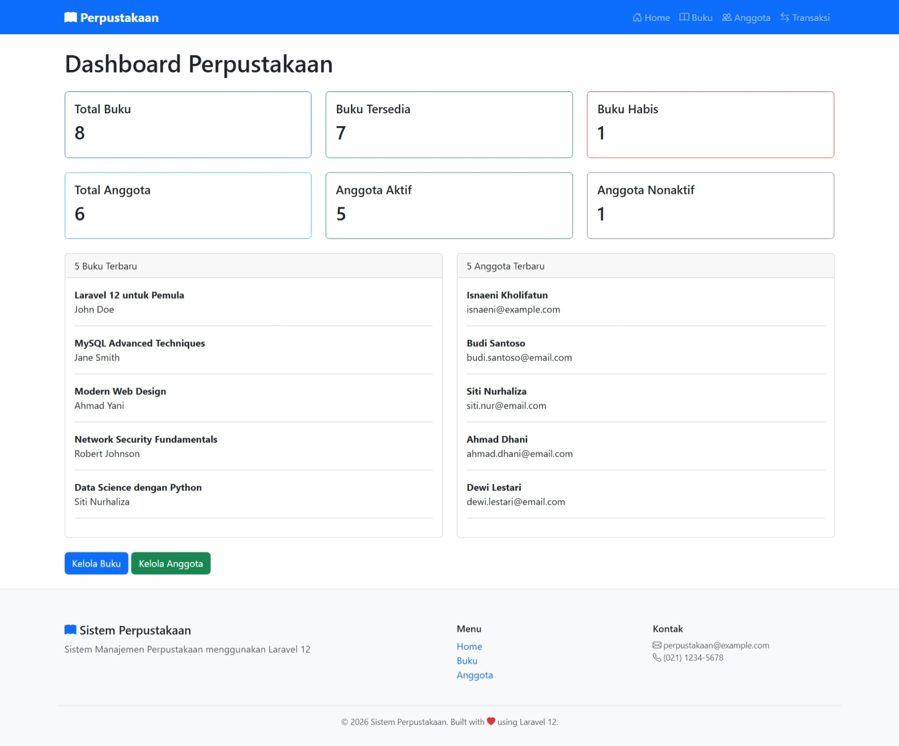
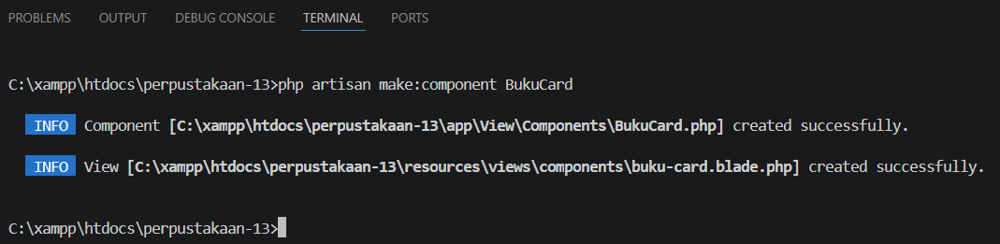
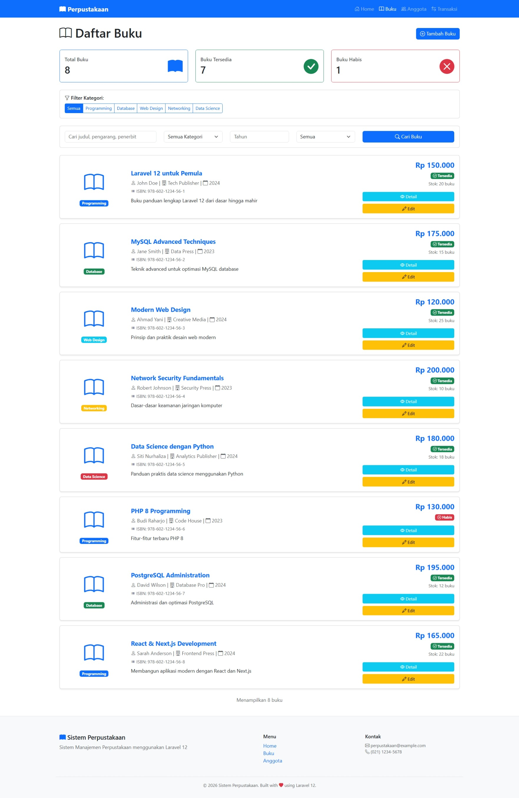
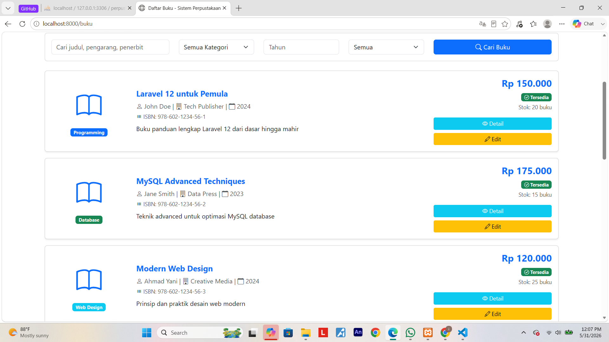
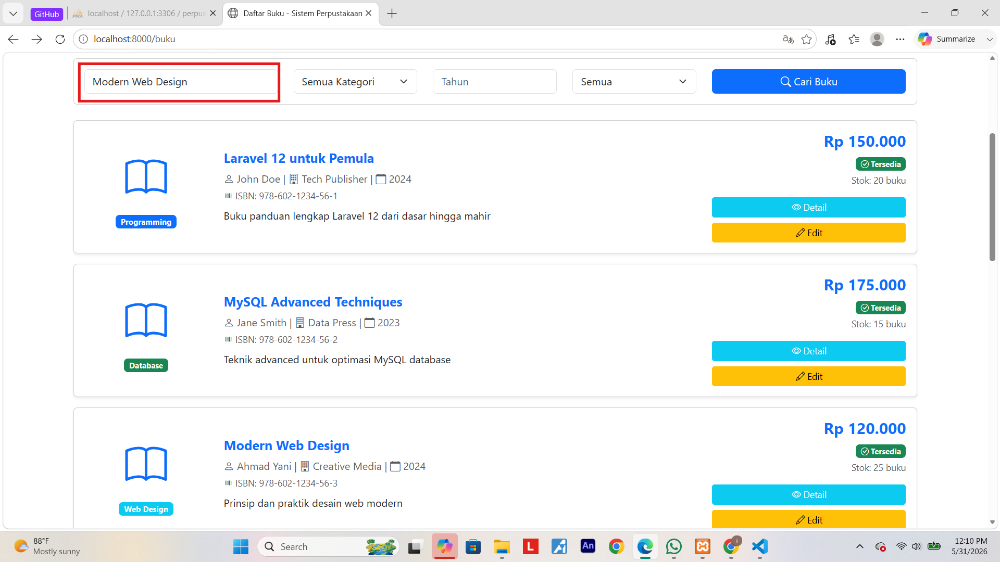
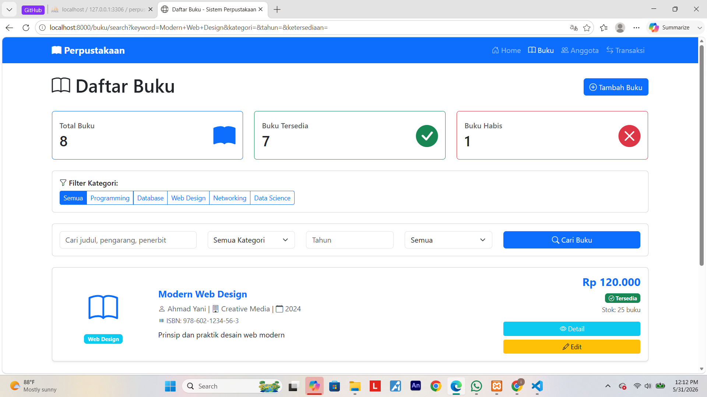

# Tugas Pertemuan 11 - CONTROLLER, VIEW, & BLADE COMPONENT (MVC PATTERN)

**Identitas Mahasiswa:**
* **Nama:** Isnaeni Kholifatun
* **NIM:** 60324075
* **Prodi:** Informatika
* **Semester:** 4
* **Mata Kuliah:** Pemrograman Web II
* **Repository:** [https://github.com/isnaenikholifatun/Pertemuan11-CONTROLLER-VIEW-MVC-PATTERN-](https://github.com/isnaenikholifatun/Pertemuan11-CONTROLLER-VIEW-MVC-PATTERN-)

---

## Tugas 1 : Membuat halaman dashboard yang menampilkan ringkasan statistik perpustakaan.

**Perintah yang dijalankan:**
* Buat Controller `DashboardController` dengan method `index()`: `php artisan make:controller DashboardController`
* Menambahkan route `dashboard`
* Membuat view dashboard
* Menampilkan statistik buku dan anggota

**Data yang Ditampilkan:**
* Total buku, Buku tersedia, Buku habis
* Total anggota, Anggota aktif, Anggota nonaktif
* List 5 buku terbaru & 5 anggota terbaru

**Screenshot:**

#### 1. Perintah Membuat Controller


#### 2. Tampilan Data Dashboard


---

## Tugas 2 : Membuat Blade Component reusable untuk menampilkan card buku.

**Perintah yang dijalankan:**
* Generate Component: `php artisan make:component BukuCard`
* Mengatur Component Properties (`$buku` dan `$showActions`)
* Mendesain layout card di `buku-card.blade.php`

**Spesifikasi Card:**
* Menampilkan: Icon cover, judul, pengarang, harga, dan stok
* Badge kategori (Programming, Database, dll)
* Status ketersediaan (Tersedia/Habis)
* Tombol aksi (Detail & Edit) bersifat kondisional

**Component yang Digunakan:**
```html
<x-buku-card :buku="$buku" />
```

**Screenshot:**

#### 1. Perintah Generate Component


#### 2. Hasil Blade Component Buku Card


---

## Tugas 3 : Menambahkan fitur pencarian dan filter advanced untuk buku.

**Perintah yang dijalankan:**
* Membuat method `search` pada `BukuController`
* Menambahkan route `/buku/search`
* Membuat form filter pada view index buku

**Fitur Search & Filter:**
* Input keyword (search judul, pengarang, penerbit)
* Filter kategori, tahun, dan ketersediaan

**Screenshot:**

#### 1. Form Search Buku


#### 2. Proses Pencarian Berdasarkan Judul


#### 3. Hasil Pencarian Judul
